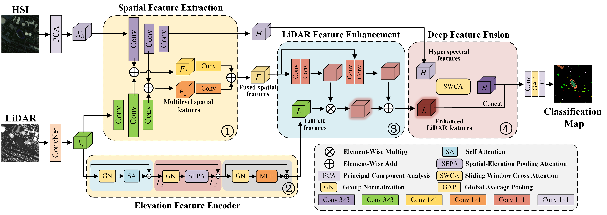

# Spatial-Guided LiDAR Spatial-Elevation Feature Enhancement Network for Fusion Classification of Hyperspectral and LiDAR Data

Here, we provide the pytorch implementation of the paper: Spatial-Guided LiDAR Spatial-Elevation Feature Enhancement Network for Fusion Classification of Hyperspectral and LiDAR Data.

The implementation details of the model will be made public after the paper is received.



## Requirements

```
Python 3.9.7
pytorch 1.9.0
torchvision 0.10.0
numpy  1.22.2
```

## Results
| Dataset | OA(%) | AA(%) | Kappa×100 |
| :----: | :----: | :----: | :----: |
| Houston  | 96.32 | 96.44 | 96.01 |
| Trento  | 99.09 | 98.52 | 98.78 |
| MUUFL  | 90.61 | 91.01 | 87.70 |
| Houston  | 94.11 | 94.95 | 92.58 |

## Train SGFEN
```
python SGFEN-Houston.py
```

## Data Download 
Houston：https://pan.baidu.com/s/13c0h5A1fnJOKWkuG9oZlig?pwd=ouhw

Trento：https://pan.baidu.com/s/1fTM4iUZOdd7LeZ1iKkVvoA?pwd=6z62 

MUUFL：https://pan.baidu.com/s/1nXBUFR-KDa-q_npbkmMh1Q?pwd=wi62 
